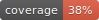
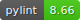

<a name="readme-top"></a>

<br />
<div align="center">
  <a href="https://www.sdmx2023.org/hackathon">
    
  </a>

  <h3 align="center">README</h3>

  <p align="center">
    SDMX Dashboard Generator
    <br />
    <a href="https://www.sdmx2023.org/hackathon"><strong>SDMX Hackathon Global Conference 2023 »</strong></a>
    <br />
  </p>
</div>

  <p align="center">
     
  </p>

<details>
  <summary>Table of Contents</summary>
  <ol>
    <li>
      <a href="#about-the-project">About The Project</a>
      <ul>
        <li><a href="#built-with">Built With</a></li>
      </ul>
    </li>
    <li>
      <a href="#getting-started">Getting Started</a>
      <ul>
        <li><a href="#installation">Installation</a></li>
        <li><a href="#how-to-with-examples">How to with examples</a></li>
      </ul>
    </li>
    <li><a href="#usage">Usage</a></li>
    <li><a href="#contributing">Contributing</a></li>
    <li><a href="#license">License</a></li>
    <li><a href="#acknowledgments">Acknowledgments</a></li>
  </ol>
</details>

## About The Project

The objective of hackathon challenge is to develop an open-source responsive web application which effectively reads a specification file and retrieves data from SDMX APIs to create a dynamic dashboard. The web application will provide dashboard designers with a user-friendly interface to create customizable dashboards, effortlessly integrating data from SDMX APIs and offering rich visualization options. The project aims to empower dashboard designers to explore, analyse, and present data from SDMX sources in a visually appealing and intuitive manner.

The SDMX dashboard generator will provide a valuable solution for data analysts, researchers, policymakers, and organizations seeking to harness the power of SDMX data through customizable dashboards. By simplifying the process of integrating SDMX data and specification files, dashboard generator will empower users to gain actionable insights and make informed decisions based on authoritative and up-to-date data. The open-source nature of the dashboard generator will foster collaboration, customization, and community contributions, driving continuous improvement and innovation.

Source: <a href="https://www.sdmx2023.org/hackathon">SDMX 2023 Hackathon</a>

<p align="right">(<a href="#readme-top">back to top</a>)</p>

## Introduction and documentation

SDMX Dashboard Generator is an open-source [Dash](https://dash.plotly.com) application that generates dynamic dashboards by pulling data and metadata from SDMX Rest API. It supports the version 2.1 of the standard. It leverages the open-source library [SDMXthon](https://github.com/Meaningful-Data/sdmxthon) to retrieve and parse data and metadata in SDMX. A dashboard is composed of several visualizations as defined by the specifications provided in a `.yaml` file stored in the `/yaml` folder.

The documentation for this app is freely available at [GitHub Pages](https://urban-memory-73nlz2m.pages.github.io/index.html).

<p align="right">(<a href="#readme-top">back to top</a>)</p>

## Getting Started

To get a local copy up and running follow these simple example steps.

## Installation

1. Clone the repo

   ```sh
   git clone https://github.com/bis-med-it/SDMX-dashboard-generator.git
   ```

2. Install dependencies

   ```sh
   cd SDMX-dashboard-generator
   pip install -r requirements.txt
   ```

   If you wish to contribute, you can install the optional development requirements:

   ```sh
   pip install -r requirements/dev_requirements.txt
   ```

3. Run the app

   ```sh
   python3 app.py
   ```

4. Open your browser at [http://127.0.0.1:5000](http://127.0.0.1:5000) if you use Flask or [http://127.0.0.1:8050](http://127.0.0.1:8050)

<p align="right">(<a href="#readme-top">back to top</a>)</p>

## How to with examples

The application comes with examples stored in the `/yaml` folder which can be used in two ways:

- by uploading one `.yaml` file in the interface via drag and drop or
- by typing the `DashID` of the dashboard in the URL (i.e. [http://127.0.0.1:5000/eurostat](http://127.0.0.1:5000/eurostat) for the `eurostat_sample.yaml` file which contains `DashID: eurostat`).

The application will scan the existing content in the `yaml` subfolder of the project and load the `.yaml` file containing the requested `DashID`. If none is found, the app will raise a `PreventUpdate`.

<p align="right">(<a href="#readme-top">back to top</a>)</p>

## Contributing

Any contribution is welcome:

2. Create your branch
3. Commit your changes
4. Push to the branch
5. Open a Pull Request

For uniform and clean code, please consider integrating [flake8](https://flake8.pycqa.org/en/latest/) and [black](https://black.readthedocs.io/en/stable/index.html) as part of your workflow.
A configuration for the former is already provided, and you can find a [good introduction here](https://medium.com/@huzaifazahoor654/improving-code-quality-with-flake8-and-black-a-guide-for-python-developers-c374168d5884).
<p align="right">(<a href="#readme-top">back to top</a>)</p>

## License

The source code in this repository is licensed under Apache-2.0. See `LICENSE.pdf` for more information.

<p align="right">(<a href="#readme-top">back to top</a>)</p>

## Acknowledgments

This app has been developed by Cristina Leonte, Pietro Patelli, Stephan Probst and Olivier Sirello (Bank for International Settlements).

<p align="right">(<a href="#readme-top">back to top</a>)</p>
