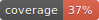
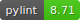

 

  

  <h3 align="center">README</h3>

  

    SDMX Dashboard Generator
     
    <a href="https://www.sdmx2023.org/hackathon"><strong>SDMX Hackathon Global Conference 2023 »</strong></a>
     
  

  

       
  

## About The Project

The objective of hackathon challenge is to develop an open-source responsive web application which effectively reads a specification file and retrieves data from SDMX APIs to create a dynamic dashboard. The web application will provide dashboard designers with a user-friendly interface to create customizable dashboards, effortlessly integrating data from SDMX APIs and offering rich visualization options. The project aims to empower dashboard designers to explore, analyse, and present data from SDMX sources in a visually appealing and intuitive manner.

The SDMX dashboard generator will provide a valuable solution for data analysts, researchers, policymakers, and organizations seeking to harness the power of SDMX data through customizable dashboards. By simplifying the process of integrating SDMX data and specification files, dashboard generator will empower users to gain actionable insights and make informed decisions based on authoritative and up-to-date data. The open-source nature of the dashboard generator will foster collaboration, customization, and community contributions, driving continuous improvement and innovation.

Source: <a href="https://www.sdmx2023.org/hackathon">SDMX 2023 Hackathon</a>

## Documentation

The documentation for this app is freely available at [GitHub Pages](https://urban-memory-73nlz2m.pages.github.io/index.html).

## License

The source code in this repository is licensed under Apache-2.0. See `LICENSE.pdf` for more information.

## Acknowledgments

This app has been developed by Cristina Leonte, Pietro Patelli, Stephan Probst and Olivier Sirello (Bank for International Settlements).
