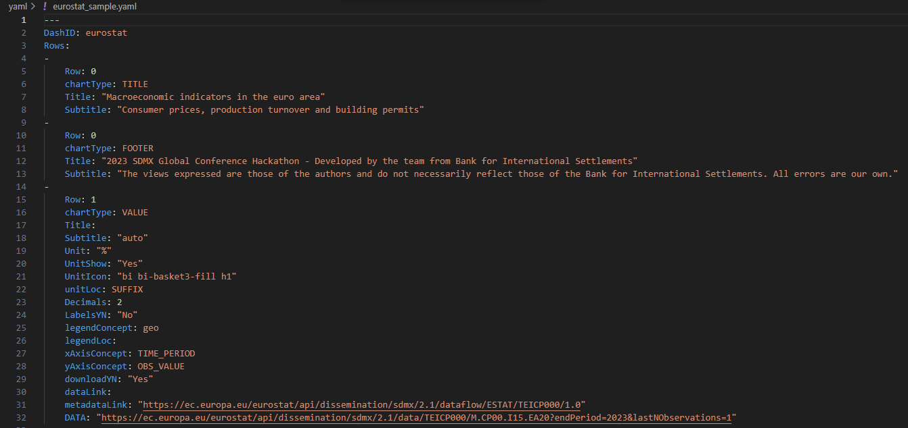

# Getting started

This page contains useful tips to install and run the app.
Make sure that your environment is correctly set up to execute Python code and that your `pip` and `Python` are up-to-date.
The app has been successfully tested with Python versions equal or higher to 3.9.13.

## Installation

1. Clone the repo

   ```sh
   git clone https://github.com/bis-med-it/SDMX-dashboard-generator.git
   ```

2. (Recommended) Create virtual environment using `virtualenv`

   ```sh
   python.exe -m pip install --upgrade pip
   pip install virtualenv
   cd SDMX-dashboard-generator/
   virtualenv venv --system-site-packages
   .\venv\Scripts\activate
   ```

   or if you use `virtualenvwrapper`

   ```sh
   python.exe -m pip install --upgrade pip
   pip install virtualenvwrapper
   cd SDMX-dashboard-generator/
   mkvirtualenv SDMX-dashboard-generator
   workon SDMX-dashboard-generator
   ```

3. Install dependencies

   ```sh
   python.exe -m pip install --upgrade pip
   cd SDMX-dashboard-generator
   pip install -r requirements.txt
   ```

   If you wish to contribute, you can install the optional development requirements:

   ```sh
   pip install -r requirements/dev_requirements.txt
   ```

4. From the root folder, run the app

   ```sh
   python app.py
   ```

5. Open your browser at [http://127.0.0.1:5000](http://127.0.0.1:5000) if you use Flask or [http://127.0.0.1:8050](http://127.0.0.1:8050)

## How to with examples

### Upload the YAML file

The application comes with examples stored in the `/yaml` folder which can be used in two ways:

- by uploading one `.yaml` file in the interface via drag and drop or<br/>

- by typing the `DashID` of the dashboard in the URL (i.e. [http://127.0.0.1:5000/eurostat](http://127.0.0.1:5000/eurostat) for the `eurostat_sample.yaml` file which contains `DashID: eurostat`)<br/>


The application will scan the existing content in the `yaml` subfolder of the project and load the `.yaml` file containing the requested `DashID`. If none is found, the app will raise a `PreventUpdate`.

### Example of YAML file settings

Example of `.yaml` structure:



- `DashID`: dashboard identifier using any string composed of numbers, letters, and underscores (_), which can be used to compose the URL to display the dashboard. For example, if the base URL of the application is `http://127.0.0.1:5000` and the `DashID` is `eurostat`, the dashboard might be displayed at [http://127.0.0.1:5000/eurostat](http://127.0.0.1:5000/eurostat)

- `Row`: row position of the visual indicated as an integer value 0…3. Up to three charts can share the same row and they are distributed left-right in the order they appear in the specification file. Title, subtitle and footnotes are identified with `Row=0` and `chartType=TITLE` and `chartType=FOOTER` respectively

- `Title`: title description of the chart. If no title is specified, the dashboard shows automatically the name of the requested dataflow, supported by multilingual translation

- `Subtitle`: a string to complement the title description of the chart. If `auto` is provided, the subtitle takes the code name from `legendConcept`. If more than one code name is available, then it will take the first one and append to it `...`. If the subtitle node is empty, no subtitle will be shown

- `Unit`: a string to describe the unit which can be show in the chart if `UnitShow` is set to `Yes`

- `UnitIcon`: a bootstrap icon to be show on top of the KPI. Full list available at: [https://icons.getbootstrap.com/](https://icons.getbootstrap.com)

- `Decimals`: the number of decimals to display

- `chartType`: it can be KPI (i.e. VALUE) or charts (i.e. PIE, LINE and BAR)

- `legendConcept`: indicates the dimension that defines multiple series to be displayed in the visualization (e.g. sectors of the pie chart, each of the lines in a lines chart or each cluster in a bar chart)

- `legendloc`: indicates the legend location which can be TOP, BOTTOM, LEFT, RIGHT or HIDE for no legend. Not applicable to the KPI

- `LabelsYN`: indicates ("Yes"/"No") whether the description of each category is to be displayed on the chart. Not applicable to the KPI

- `xAxisConcept`: indicates the concept to be allocated on the x-axis (e.g. TIME_PERIOD for LINES)

- `yAxisConcept`: indicates the concept to be allocated to the y-axis (e.g. OBS_VALUE)

- `downloadYN`: indicates ("Yes"/"No") whether the download of the data behind the chart

- `dsdLink`: an URL of an application or file containing related the datastructure data

- `metadataLink`: an URL of an application or file containing reference metadata (e.g. used in the info button)

- `DATA`: an URL of an application or file containing data