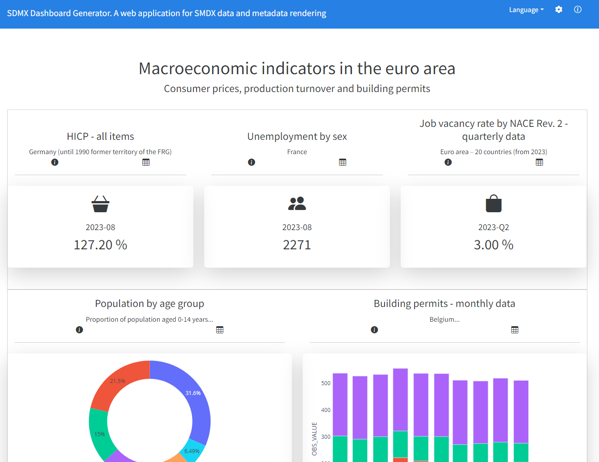

Welcome to SDMX Dashboard Generator's documentation!
====================================================

The SDMX Dashboard Generator (SDMX-DG) is an open-source [Dash](https://dash.plotly.com) application that 
generates dynamic dashboards by pulling data and metadata from SDMX Rest API. It supports the version 2.1 
of the standard. It leverages the open-source library SDMXthon to retrieve and parse data and metadata in SDMX. 
Data and metadata are supported by asynchronous retrieval. A dashboard is composed of several visualizations 
as defined by the specifications provided in a .yaml file. The specifications are interpreted by a ChartGenerator 
class containing instructions to define the Plotly charts. It has been developed for the 
[SDMX Hackathon Global Conference 2023](https://www.sdmx2023.org/hackathon).

.. toctree::
   :maxdepth: 3
   :caption: General

   walkthrough
   getting_started
   release_notes

.. toctree::
   :maxdepth: 1
   :caption: Modules

   modules

.. toctree::
   :maxdepth: 1
   :caption: Help

   troubleshooting
   contributing

Indices and tables
==================

* :ref:`genindex`
* :ref:`modindex`
* :ref:`search`
