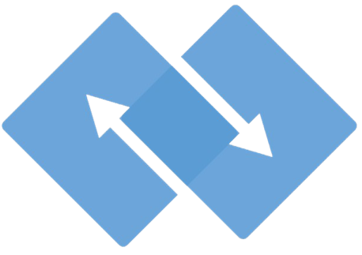
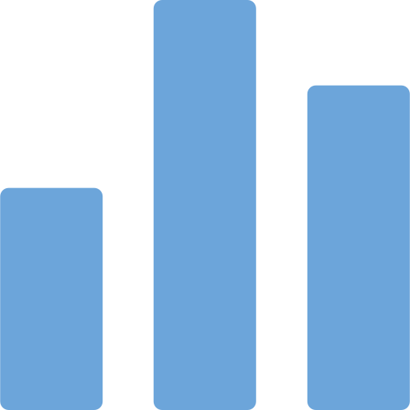
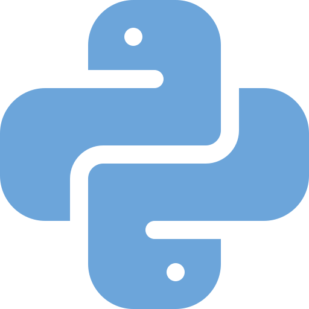
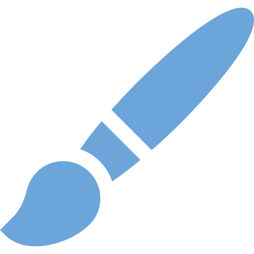
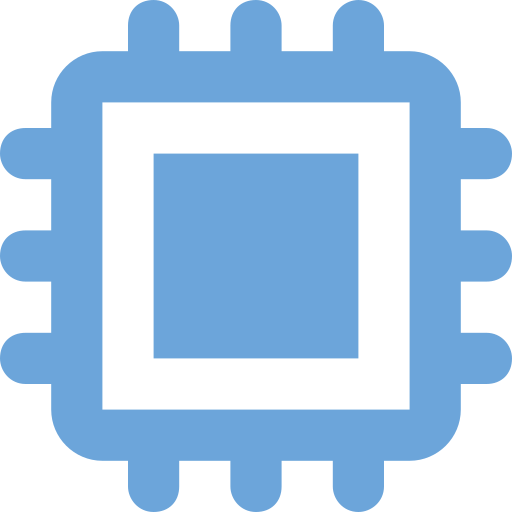
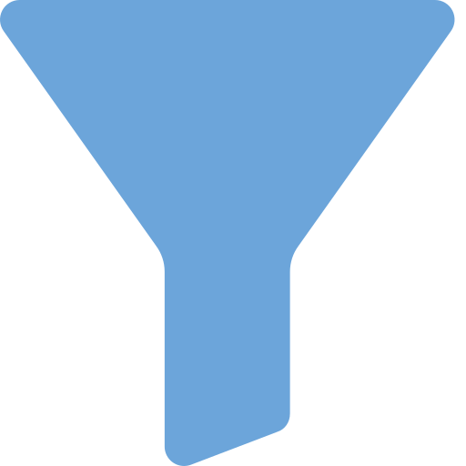
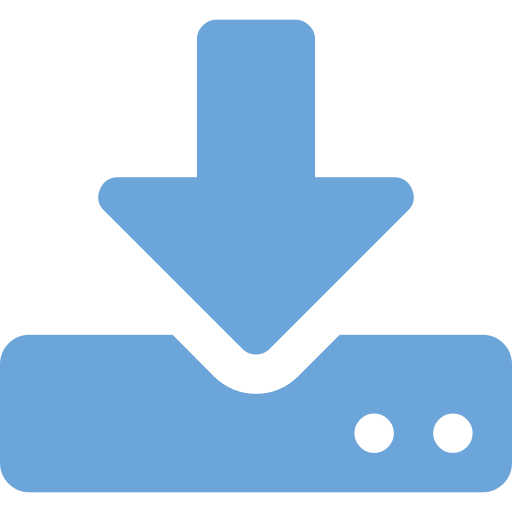
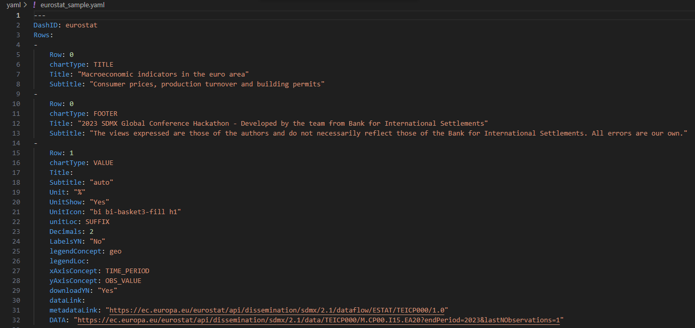

# Walkthrough

## Introduction

SDMX Dashboard generator is an open-source [Dash](https://dash.plotly.com) application that generates dynamic dashboards by pulling data and metadata from SDMX Rest API. It supports the version 2.1 of the standard. It leverages the open-source library [SDMXthon](https://github.com/Meaningful-Data/sdmxthon) to retrieve and parse data and metadata in SDMX. A dashboard is composed of several visualizations as defined by the specifications provided in a `.yaml` file stored in the `/yaml` folder.

This library has been developed for the [SDMX Hackathon Global Conference 2023](https://www.sdmx2023.org/hackathon).

## Main features 

  

  
  

SDMX integration

  Reading of settings file (`.yaml`) for data and metadata retrieval

  

  
  

  
  

Interactive graphs

  Plotly for dynamic visualization (KPIs, line charts, pie charts and bar graphs)
  

  

  
  

Open source code

  Reliance on open-source libraries
  

  

  
  

Flexible design

  - Position and size of the elements displayed automatically adjusted
  - Bootstrap components to modify themes, icons, and incorporate HTML5 elements
  

  
  

  
  

Optimized performance

  - SDMX hierarchy (data structure, dataflow and data)
  - Cross-sources asynchronously processed
  

  

  
  

Dynamic filtering

  Data accessible with table format supported by dynamic filters

  

  

  
  

Settings validation

  Text messages are displayed when exceptions are encountered, to guide with the right configuration of the settings
  

  
  

  
  

Searchable documentation

  Sphinx documentation automatically updated to support the exploration of the material
  

  

  
  

Multilingual support

  Multi-lingual metadata to access titles, labels and info buttons in the desired language, when supported by SDMX
  

  

  
  

Data download

  Data accessible with table format supported by download export (CSV)
  

  
  

  
  

Collaboration

  - User-independent access within the same company and across countries
  - Worldwide contribution (feedback and pull requests via Github) are welcome

  

  

  
  

Future enhancements

  - multiple pages application
  - settings in a new tab
  - interactivity (search, simulation..)
  - chart types (mix, map, dual-axis, flows, network, outlier..)
  - commercial data.
  

## High-level architecture
The application is built around four main components:

  
SDMX data and metadata

  - The Statistical Data and Metadata Exchange (SDMX) is a standard to facilitate the exchange of statistical data and metadata using modern information technology. This application leverages the standard to retrieve data and metadata in a consistent and user-friendly way. It leverages two classes, `SDMXData` and `SDMXMetadata`, which are built on top of the open-source package [SDMXThon](https://github.com/Meaningful-Data/sdmxthon). The data retrieval functions return a Pandas DataFrame. 
  - As far as the metadata are concerned, a more advanced flow has been implemented in order to enrich the dashboard with as many as information as available and requested. In short, when the metadata url has been provided (`dataflow`), the application retrieves all related information, including the codes associated to the codelist flagged as legend concept in the settings. This feature is key to provide also multilingual support (e.g. chart legend items). Since the parsing of large metadata files could be resource-intensive, the user is also given the option to specify the DSD url (`datastructure`) which is lighter.

  
The specification file</strong>

> ### Configuration

>> SDMX Dashboard Generator requires a `.yaml` file with the settings for the dashboard. This file follows the specifications indicated by the [SDMX Hackathon Global Conference 2023 Terms of Reference](https://sdmx.org/wp-content/uploads/SDMX-Hackathon-2023-ToRrev.pdf).

>> Example of `.yaml` structure: 
>> 

>  ### DashID
>> Any string composed of numbers, letters, and underscores (_) used to identify the dashboard. This ID will be used to compose the URL to display the dashboard. For example, if the base URL of the application is `http://127.0.0.1:5000` and the DashID is `eurostat`, the dashboard might be displayed at [http://127.0.0.1:5000/eurostat](http://127.0.0.1:5000/eurostat).

>  ### Row
>> An integer value 0…3 that indicates the row where the visual is to be located. Unlimited number of rows is allowed. Up to three charts can share the same row and they are to be distributed left-right in the order they appear in the specification file. A node with Row=0 and chartType=TITLE allows to define Title and Subtitle for the dashboard. Row=0 and chartType=FOOTER to specify up to two lines in Title and Sub-title nodes for the bottom of the dashboard.

>  ### Title
>> A string to describe the chart. If no title is specified, the dashboard will automatically show the name of the requested dataflow. The latter supports translation.

>  ### Subtitle
>> A string to complement the description in the title. If `auto` is provided, the subtitle will be generated by taking the code name from `legendConcept`. If more than one code name is available, then it will take the first one and append to it `...`. If the subtitle node is empty, no subtitle will be shown.

>  ### Unit
>> A string to describe the unit which can be show in the VALUE chart type next to the observation value if `UnitShow` is set to `Yes`.

>  ### UnitIcon
>> A boostrap icon to be show on top of the VALUE chart. Full list available at: [https://icons.getbootstrap.com/](https://icons.getbootstrap.com).

>  ### Decimals
>> Defines the number of decimals to display the observation value.

>  ### chartType:
>> It can be KPI (i.e. VALUE) or charts (i.e. PIE, LINE and BAR).

>  ### legendConcept
>> Indicates the dimension that defines multiple series to be displayed in the visualization (e.g. sectors of the pie chart, each of the lines in a lines chart or each cluster in a bar chart).

>  ### legendLoc
>> Legend location which can be TOP, BOTTOM, LEFT, RIGHT or HIDE for no legend. This is not applicable for VALUE.

>  ### LabelsYN
>>  Possible values are "Yes"/"No" and indicates whether the description of each category is to be displayed on the chart. This is not applicable for VALUE.

>  ### xAxisConcept
>> Indicates the concept to be allocated to the “x” axis (e.g. TIME_PERIOD for LINES).

>  ### yAxisConcept
>> Indicates the concept to be allocated to the “y” axis (e.g. OBS_VALUE).

>  ### downloadYN
>> Possible values are "Yes"/"No" and indicates whether the download of the data behind the chart is allowed and by clicking on it the link opens in an off-canvas to download the table with the data.

>  ### dsdLink
>> An URL of an application or file containing related the datastructure data.

>  ### metadataLink
>> An URL of an application or file containing reference metadata. If present, an 'i' icon is displayed below the title, and by clicking on it the link opens in an off-canvas.

>  ### DATA
>> An URL of an application or file containing data.

  
The Dash application

   The application source code is contained in the file `app.py`, which:
- is entirely based on Dash, a Python open-source framework to create web applications in a flexible and scalable way;
- can run both on locally or shared across the domain;
- reads a `.yaml` file stored in the `/yaml` folder which contains the specifications of the dashboard;
- organises the content across the dashboard by displaying charts following the guideliens provided in the [SDMX Hackathon Global Conference 2023 Terms of Reference](https://sdmx.org/wp-content/uploads/SDMX-Hackathon-2023-ToRrev.pdf) (e.g. a maximum of three charts per row is allowed).

  
The ChartGenerator

   The ChartGenerator source code is contained in the file `src/draw.py`, which consists in a python class allowing the user to select a function for the desired chart type, corresponding to the `chartType` from the `.yaml` file:

- `chartType: VALUE`: returns a KPI based on the provided DataFrame; A single value corresponding to an observation value at a given point in time displayed in the visual placeholder with Decimals number of decimal positions. It may include a Title and a Subtitle. The Unit may appear located at UnitLoc. The queries specified in DATA must return a single value. Should it return more than one value, the first one will be used.

- `chartType: PIE`: returns a pie chart composed by the values returned by the query(ies) specified in DATA which sum represents the full circle (360°). Each value will define a sector of x°, proportional to the fraction of the total it represents. If a single query is specified in DATA, it must return multiple observations for the dimension in legendConcept, which labels will appear in the legend. All the other dimensions are assigned a constant value in the filters.

- `chartType: LINES`: returns a lines chart including one or multiple series, either time series or cross-sectional. For time series representation (the usual case), xAxisConcept is TIME_PERIOD, but any other dimension can be specified in case of cross-sectional series. yAxisConcept should normally be OBS_VALUE. The query or queries specified in DATA may return one or multiple series. If a single query is used, it must return multiple observations for the dimension in xAxisConcept (usually TIME_PERIOD) and, eventually, for a second dimension specified in legendConcept that define multiple series, one for each of its returned values. All the other dimensions must be assigned a constant value in the filters. When DATA includes multiple queries, each one will return one series (one line) and all of them must have the dimension specified in legendConcept open to multiple values.

- `chartType: BARS`: returns a vertical bars chart including one or multiple series (clustered bars), either time series or cross-sectional. xAxisConcept can be any dimension which values will identify each bar. yAxisConcept (the height of the bar) should normally be OBS_VALUE. The query or queries specified in DATA may return one or multiple series. If a single query is used, it must return multiple observations for the dimension in xAxisConcept and, eventually, for a second dimension specified in legendConcept that define multiple series, one for each of its returned values. This concept definesthe “clusters” of bars. All the other dimensions must be assigned a constant value in the filters. When DATA includes multiple queries, each one will return one series (one cluster) and all of them must have the dimension specified in legendConcept open to multiple values.

Each function, with the exception of the one returning the KPI, makes use of `decorator` elements for enriching the chart with style elements (e.g. legendlocation).

