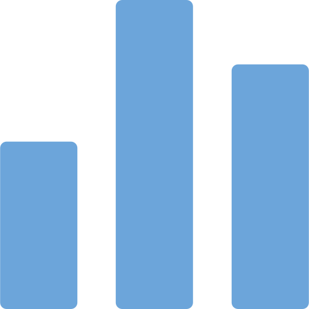

# Walkthrough

## Introduction

SDMX Dashboard Generator is an open-source [Dash](https://dash.plotly.com) application that generates dynamic dashboards by pulling data and metadata from SDMX Rest API.
It has been developed for the [SDMX Hackathon Global Conference 2023](https://www.sdmx2023.org/hackathon).

## Main features

  

  
  

SDMX integration

  Version 2.1 supported

  Reading of settings file (`.yaml`) for data and metadata retrieval

  

  
  

  
  

Interactive graphs

  
  Plotly for interactive visualization

  Multiple charts supported: KPIs, line, pie and bar charts

  

  

  
  

Open source code

  Apache 2.0 licence

  Open-source libraries

  

  

  
  

Flexible design

  Position and size automatically adjusted

  Bootstrap components to modify themes, icons and incorporate HTML5 elements

  

  
  

  
  

Optimized performance

  Data and metadata asynchronous retrieval

  Caching methods for better user navigation

  

  

  
  

Dynamic data filtering and download

  Data accessible with table format supported by dynamic filters and download export (CSV)

  

  

  
  

Multilingual support

  Multi-lingual metadata to access titles, labels and info buttons in the desired language, when supported by SDMX

  Automatic titles and subtitles in multiple languages, when specified by the user

  

  
  

  
  

Searchable documentation

  Sphinx documentation automatically updated to support the exploration of the material

  Documentation deployment via GitHub Actions

  

  

  
  

Settings validation

  Text messages are displayed when exceptions are encountered, to guide with the right configuration of the settings

  Software engineering components (i.e. unit tests using pytest, coverage reporting, continuous integration using tox, automated license monitoring, code linting using pylint and flake8)

  

  

  
  

Security components

  Security testing using bandit

  Software composition analysis using GitHub Dependabot

  Secret scanning using Github Advanced Security

  

  
  

  
  

Collaboration

  User-independent access within the same company and across countries

  Worldwide contribution (feedback and pull requests via Github) are welcome

  

  

  
  

Future enhancements

  Settings in a new tab or dropdown menu

  Interactivity (search, simulation)

  Add support for other chart types (mix, map, dual-axis, flows, network, outlier)

  

## High-level architecture

  

  
  

The Dash application

  source code contained in the file `app.py`

  can run both on locally or shared across the domain

  follows the guidelines provided in the [SDMX Hackathon Global Conference 2023 Terms of Reference](https://sdmx.org/wp-content/uploads/SDMX-Hackathon-2023-ToRrev.pdf) (e.g. a maximum of three charts per row is allowed)

  

  

  

  
  

  
  

  
  

  

  
  

  

  
  

SDMX

  Leveraging two classes, `SDMXData` and `SDMXMetadata`, built on top of [SDMXThon](https://github.com/Meaningful-Data/sdmxthon)

  Metadata (e.g. codelist for the legend or multilingual support) retrieval through a metadata url (`dataflow`)

  When supported by SDMX, the metadata is retrieved through DSD url (`datastructure`) to increase the speed performance

  

  
  

  
  

The specification file

The SDMX Dashboard Generator requires a `.yaml` file with the settings for the dashboard. Please see <a href="/getting_started#how-to-with-examples">this example</a> for more details.

  

  

  
  

The ChartGenerator

  The ChartGenerator is a class contained in the file `src/draw.py`, allowing the user to select the `chartType` from the `.yaml` file:

  - `chartType:VALUE` returns a Key Performance Indicator (KPI), a value corresponding to an observation value at a given point in time displayed in the visual placeholder

  - `chartType:PIE` returns a pie chart composed by the values returned by the query(ies) specified in DATA which sum represents the full circle (360°). Each value defines a sector of x°, proportional to the fraction of the total it represents

  - `chartType:LINES` returns a lines chart including one or multiple series, either time series or cross-sectional

  - `chartType:BARS` returns a vertical bars chart including one or multiple series (clustered bars), either time series or cross-sectional

  Each function, with the exception of the one returning the KPI, makes use of `decorator` elements for enriching the chart with style elements (e.g. legendlocation).

  

